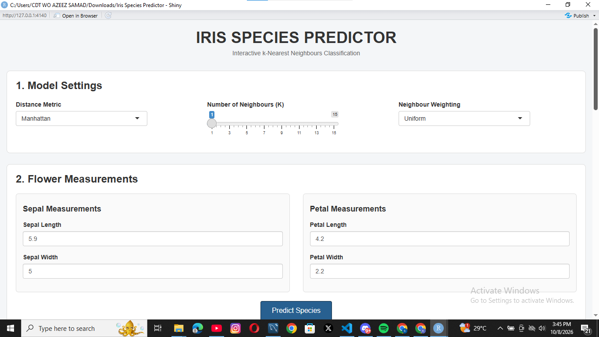
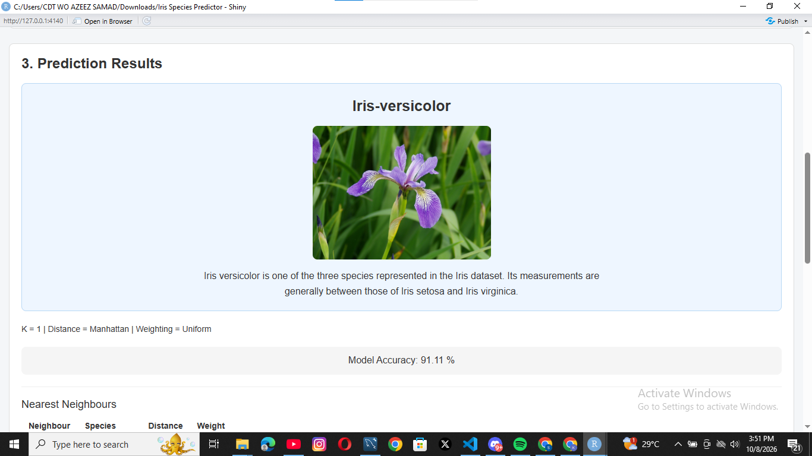
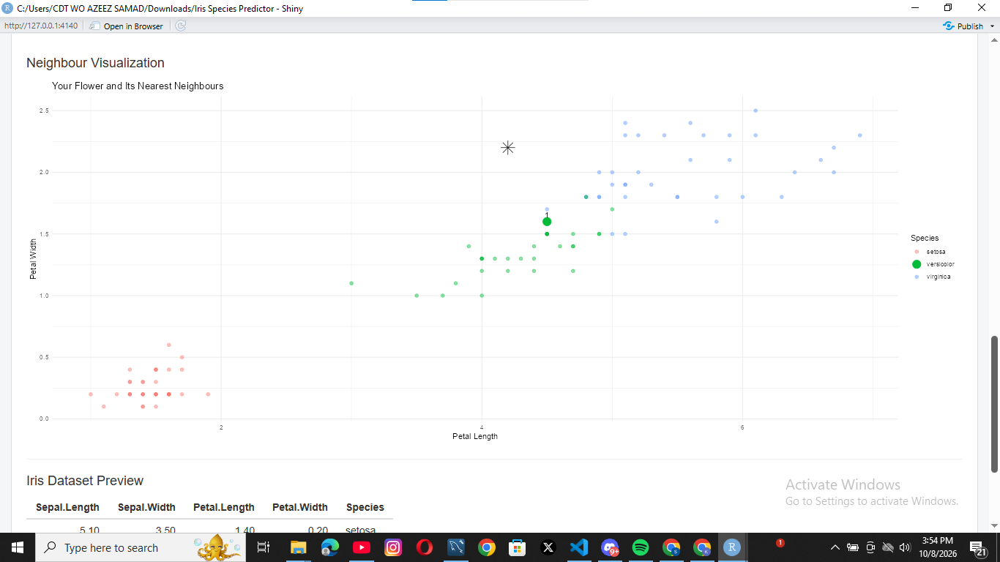
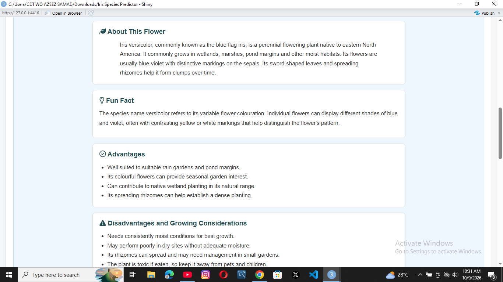

# Iris Species Predictor

 An interactive **R Shiny** application that predicts the species of an Iris flower using a **k-Nearest Neighbours (k-NN)** machine learning model. [\## Live Demo](https://am-unscripted007-iris-species-predictor.share.connect.posit.cloud/)

**Coming soon**

## Project Overview

This project turns the classic Iris dataset classification problem into an interactive web application.

A user enters the measurements of a flower, chooses the k-NN model settings, and clicks **Predict Species**. The application then predicts whether the flower is:

-   Iris-setosa
-   Iris-versicolor
-   Iris-virginica

The application also shows the nearest neighbours used for the prediction and provides a visual representation of them.

## Features

### Model Settings

The application allows the user to choose:

-   **Number of neighbours (K)** — from 1 to 15
-   **Distance metric**
    -   Euclidean
    -   Manhattan
-   **Neighbour weighting**
    -   Uniform
    -   Distance Weighted

### Flower Measurements

The user enters four measurements:

-   Sepal Length
-   Sepal Width
-   Petal Length
-   Petal Width

### Prediction Results

The application displays:

-   Predicted Iris species
-   Image of the predicted species
-   Species description
-   K value used
-   Distance metric used
-   Weighting method used
-   Model accuracy
-   Nearest-neighbour table
-   Nearest-neighbour visualization
-   Iris dataset preview

## Machine Learning Approach

The application uses the **k-Nearest Neighbours (k-NN)** algorithm through the `kknn` R package.

The Iris dataset is divided into:

-   **70% training data**
-   **30% testing data**

The testing data is used to evaluate the model's performance.

When a user enters a new flower's measurements, those measurements are passed to the model as a new observation for prediction.

The model also uses feature scaling so that the four measurements are considered on a comparable scale when calculating distances.

## Model Configuration

### Distance

Two distance metrics are available:

**Euclidean distance**

The traditional straight-line distance between observations.

**Manhattan distance**

The distance obtained by adding the absolute differences across the features.

### Weighting

**Uniform weighting**

Each selected neighbour has equal voting importance.

**Distance weighting**

Closer neighbours receive greater influence on the prediction.

## Dataset

The application uses R's built-in `iris` dataset.

The dataset contains **150 observations** from three Iris species.

The four predictor variables are:

-   `Sepal.Length`
-   `Sepal.Width`
-   `Petal.Length`
-   `Petal.Width`

The target variable is:

-   `Species`

## Technologies

-   **R**
-   **Shiny**
-   **kknn**
-   **ggplot2**

## Project Structure

``` text
iris-species-predictor/
│
├── app.R
├── README.md
├── .gitignore
├── manifest.json
└── www/
    ├── Iris_setosa.png
    ├── Iris_versicolor.png
    └── Iris_virginica.jpg
```

## Running the Application Locally

### 1. Clone the repository

``` bash
git clone https://github.com/samad-source/iris-species-predictor.git
```

### 2. Open the project

Open the project in **RStudio**.

### 3. Install the required packages

``` r
install.packages(c("shiny", "kknn", "ggplot2","fontawesome"))
```

### 4. Run the application

Open `app.R` and click **Run App**.

You can also run:

``` r
shiny::runApp()
```

## Screenshots






/

## Project Background

This project was developed from an Iris dataset analysis/classification exercise and expanded into an interactive machine-learning application.

The goal was to move from performing a classification analysis in R to building an application that allows a user to interact with the model and understand the prediction process.

## Future Improvements

Possible future improvements include:

-   Prediction probabilities
-   Confusion matrix in the application
-   More interactive visualizations
-   Input validation for unrealistic measurements
-   Additional information about each species
-   Model comparison using different values of K
-   Public deployment

## Author

**AZEEZ SAMAD** (**am_unscripted)**

GitHub: <https://github.com/samad-source>

------------------------------------------------------------------------

## License

This project is for learning and portfolio purposes.
